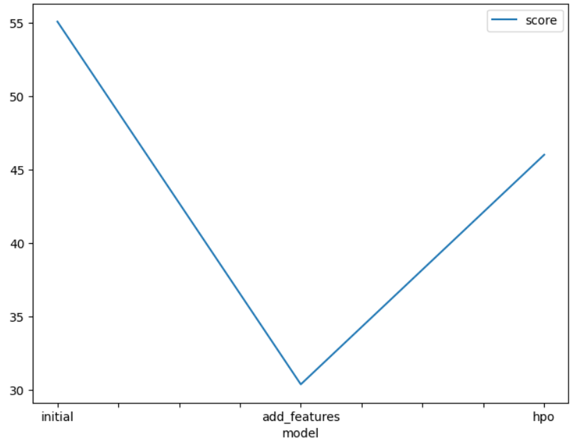
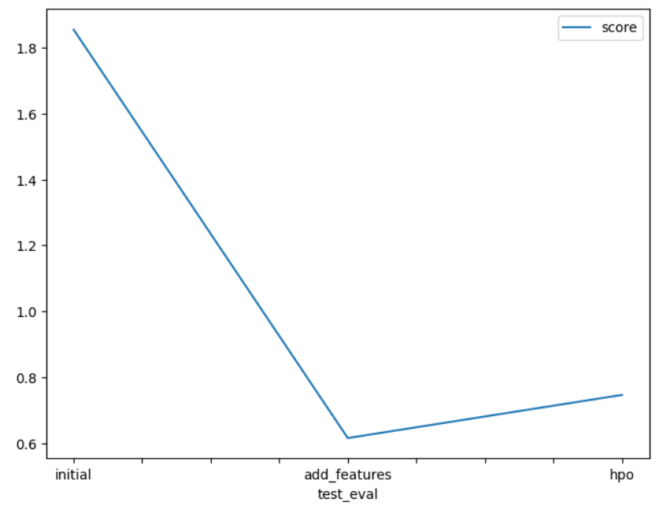

# Report: Predict Bike Sharing Demand with AutoGluon Solution
#### Karolay De La Cruz

## Initial Training
### What did you realize when you tried to submit your predictions? What changes were needed to the output of the predictor to submit your results?
I needed to convert all negative values to cero in order to be evaluated in kaggle.

### What was the top ranked model that performed?
The second model with additional features: 0.615

## Exploratory data analysis and feature creation
### What did the exploratory analysis find and how did you add additional features?
Spliting features in datetime gives better results. I added them by extraction of year, month, day, and hour of the datetime column.

### How much better did your model preform after adding additional features and why do you think that is?
Adding aditional featurs results in a RMSE reduction of 36.11% compared with the first model.

## Hyper parameter tuning
### How much better did your model preform after trying different hyper parameters?
Hyper parameters optimization  results in a RMSE reduction of 32.27% compared with the first model. Is better than the first one but not better than second with only additional features.

### If you were given more time with this dataset, where do you think you would spend more time?
In data preprocesing, selecting the most relevant columns for the prediction.

### Create a table with the models you ran, the hyperparameters modified, and the kaggle score.
|model|hpo1|hpo2|hpo3|score|
|--|--|--|--|--|
|initial|best quality,10 min|-|-|1.85504|
|add_features|best quality,10 min|additional features|-|0.61500|
|hpo|best quality,10 min|additional features|Hyperparameter optimization|0.74600|

### Create a line plot showing the top model score for the three (or more) training runs during the project.

TODO: Replace the image below with your own.

### Create a line plot showing the top kaggle score for the three (or more) prediction submissions during the project.

TODO: Replace the image below with your own.

## Summary
The way we do data preprocessing significantly impacts how well a model performs. This is evident in the results, where separating the datetime components led to a more accurate model.
